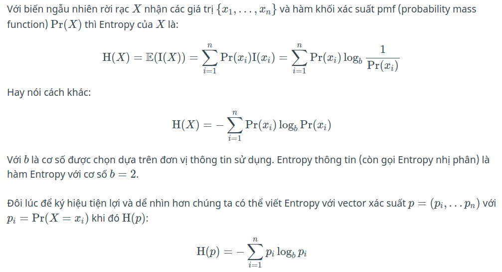
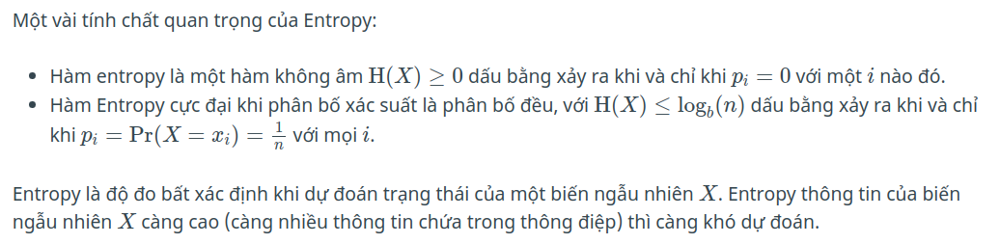
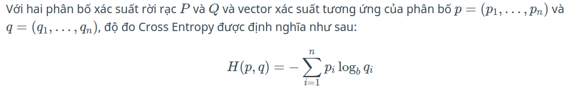
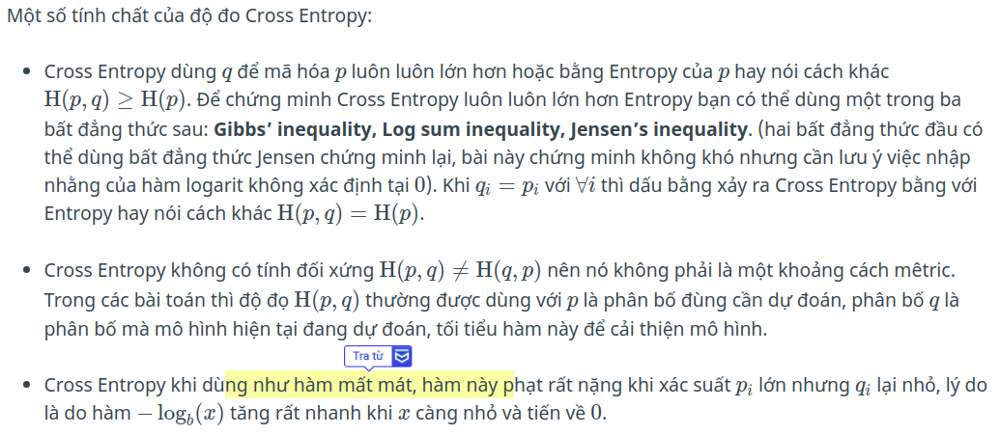

# Experiment

### Scale feature
https://medium.com/greyatom/why-how-and-when-to-scale-your-features-4b30ab09db5e

### Normalization vs Standardization
```
Normalizing the data is sensitive to outliers, so if there are outliers in the data set it is a bad practice. 
Standardization creates a new data not bounded (unlike normalization).for NN the Standardization is better 
```

https://towardsdatascience.com/normalization-vs-standardization-quantitative-analysis-a91e8a79cebf

https://machinelearningmastery.com/how-to-manually-scale-image-pixel-data-for-deep-learning/

### Understand Entropy and Cross Entropy

- Độ đo Entropy: đo lượng thông tin trung bình của một biến ngẫu nhiên, Entropy càng cao thì phân bố càng đều càng bất định (khó dự đoán).
- Độ đo Cross Entropy: đo lượng thông tin trung bình khi dùng mã hóa thông tin của một phân bố cho phân bố đích, lượng thông tin trung bình này luôn cao hơn Entropy.
- Độ đo Kullback–Leibler divergence: là hiệu của Cross Entropy trừ cho Entropy, đo độ tương tự giữa phân bố được đo và phân bố kỳ vọng, là lượng thông tin trung bình thêm vào khi sử dụng mã hóa thông tin của phân bố **q** cho phân bố **p**


- Entropy




- Cross entropy
```
Cross Entropy là độ đo giữa hai phân bố p(phân bố đúng - true distribution) và q(phân bố hiện tại - predict distribute)
để đo lượng trung bình thông tin khi dùng mã hóa thông tin của phân bố q thay cho mã hóa thông tin phân bố p
```




