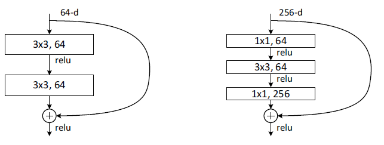
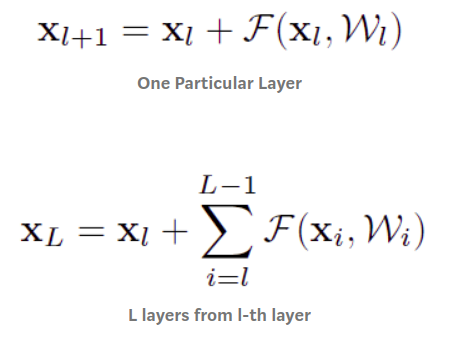
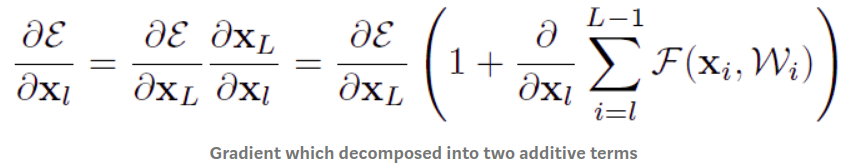

# Bottleneck Design

### Summary

- The 1x1 conv layers are added to the start and end of network. 1x1 conv reduce number operations help reduce overfit 

- A bottleneck design is used to reduce the complexity. It can reduce the number of parameters(connections) while not 
degrading the performance of network so much

- https://towardsdatascience.com/review-resnet-winner-of-ilsvrc-2015-image-classification-localization-detection-e39402bfa5d8

# Understand Skip / Shortcut Connection in Residual Network
### Summary
- Identity Mapping mean F(x) = x, ex: shortcut connection
- During backpropagation, because of Identity Mapping, the gradient does not vanish!! 
- Ex: we can always get 1 at the left term, and the right term cannot always -1 because it makes the gradients zero

# Details
- https://towardsdatascience.com/resnet-with-identity-mapping-over-1000-layers-reached-image-classification-bb50a42af03e

# Pre-Activation
### Summary
- ReLU is used in conjunction with BN( BN->ReLu)

# Global Average Polling
# Summary
- If use fully connected(FC) layer are used at the end of network, all inputs are connected to each output,
 so number of weight is large
- With global average polling is used nearly at the endof network by average map from m x n to 1x1, number of weights is 0
 
# Details
- https://medium.com/coinmonks/paper-review-of-googlenet-inception-v1-winner-of-ilsvlc-2014-image-classification-c2b3565a64e7